<!-- marcus@github:~$ ./whoami --verbose -->

<table>
  <tr>
    <td valign="top">
      
    </td>
    <td valign="top">
      
    </td>
  </tr>
</table>

 

<!-- marcus@github:~$ ./contributions --last-year --live -->

  

<!-- marcus@github:~$ cat stack.json | jq .languages -->

 

<!-- marcus@github:~$ ls -la ~/work --sort=interesting -->

| Projeto | O que é | Stack |
| :--- | :--- | :--- |
| **[ISPer](https://github.com/Marcus-Boni/ISPer)** | Transcrição local de reuniões via Whisper, direto no terminal, com sumarização por IA. Sem áudio saindo da máquina. | `Rust` |
| **[OptTime](https://github.com/Marcus-Boni/OptTime)** | Ferramenta de agenda com agentes de IA, construída durante o hackathon da empresa. | `TypeScript` `AI Agents` |
| **[Ferramenta de Estimativa](https://github.com/Marcus-Boni/Ferramenta-Estimativa-Horas)** | Substitui as planilhas manuais de estimativa de horas do Azure DevOps por uma app web por equipe. | `TypeScript` `Azure DevOps` |
| **[chatbot-template](https://github.com/Marcus-Boni/chatbot-template)** | Chatbot RAG sobre vaults do Obsidian para consultar transcrições de reuniões. | `TypeScript` `RAG` |
| **[Portfolio](https://github.com/Marcus-Boni/Marcus-Boni-Portfolio)** | Portfólio editorial-brutalista com um campo de tinta em WebGL que reage ao ponteiro e à velocidade do scroll. | `Next.js` `WebGL` |
| **[SignalR Meetup](https://github.com/Marcus-Boni/SignalR-Meetup-App)** | Demo de tempo real com SignalR, feita para uma apresentação de meetup da empresa. | `C#` `.NET` `TypeScript` |

 

<!-- marcus@github:~$ ./connect.sh -->

### Vamos conversar

<table>
  <tr>
    <td align="center">
      <a href="https://marcusboni.com.br/">🌐 <strong>Portfólio</strong></a> 
      marcusboni.com.br
    </td>
    <td align="center">
      <a href="https://www.linkedin.com/in/marcus-boni-729a52243/">💼 <strong>LinkedIn</strong></a> 
      Marcus Boni
    </td>
    <td align="center">
      <a href="mailto:mgalvaoboni@gmail.com">✉️ <strong>E-mail</strong></a> 
      mgalvaoboni@gmail.com
    </td>
    <td align="center">
      <a href="https://discord.gg/MwX9VMVT6k">💬 <strong>Discord</strong></a> 
      entrar no servidor
    </td>
  </tr>
</table>

