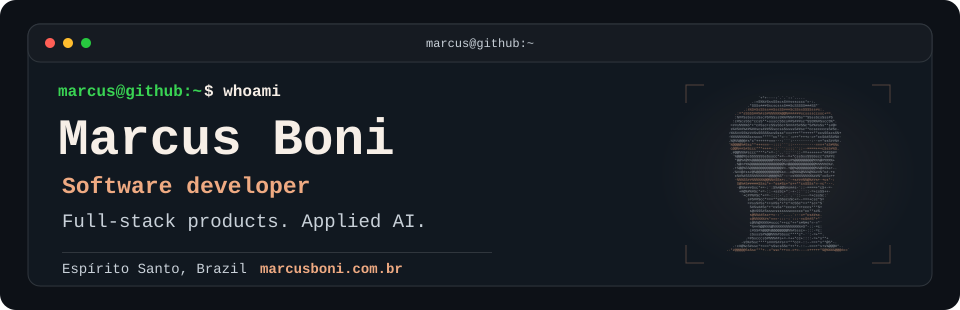

<picture>
  <source media="(max-width: 600px) and (prefers-color-scheme: light)" srcset="./assets/profile-header-mobile-light.svg" />
  <source media="(max-width: 600px)" srcset="./assets/profile-header-mobile.svg" />
  <source media="(prefers-color-scheme: light)" srcset="./assets/profile-header-light.svg" />
  
</picture>

<a href="./README.md">English</a> · <strong>Português</strong>

Sou **Marcus**, desenvolvedor de software no Espírito Santo, Brasil. Construo aplicações full-stack, ferramentas para desenvolvedores e fluxos de trabalho com IA.

[Portfólio](https://marcusboni.com.br/) · [LinkedIn](https://www.linkedin.com/in/marcus-boni-729a52243/) · [E-mail](mailto:mgalvaoboni@gmail.com)

## Projetos em destaque

### [OptTime](https://github.com/Marcus-Boni/OptTime) · Fluxos de desenvolvimento

Controle de horas conectado ao Azure DevOps: apontamentos, dashboards e automações em uma aplicação. Inclui uma extensão para o Azure DevOps e um servidor MCP para agentes trabalharem com os mesmos fluxos.

`TypeScript` `Next.js` `PostgreSQL` `Drizzle` `MCP`

### [ISPer](https://github.com/Marcus-Boni/ISPer) · Desktop e áudio

Transcrição local de voz com whisper.cpp, workspace Rust e aplicação desktop em Tauri. Componentes separados para áudio, modelos e LLMs, com builds Windows para CPU/CUDA e verificações de release.

`Rust` `Tauri` `whisper.cpp` `Windows`

### [chatbot-template](https://github.com/Marcus-Boni/chatbot-template) · Busca e IA

Template RAG para consultar transcrições de reuniões do Teams. Combina busca com pgvector, citações das fontes e consultas restritas por workspace, com avaliação da qualidade de recuperação.

`TypeScript` `Next.js` `CopilotKit` `pgvector`

### [Portfólio](https://github.com/Marcus-Boni/Marcus-Boni-Portfolio) · Design e engenharia web

Portfólio bilíngue com um campo de tinta interativo em WebGL, blog Markdown e analytics próprios. API pública, contrato OpenAPI e páginas legíveis por agentes tornam o conteúdo acessível além da interface visual.

`React` `Vite` `TypeScript` `WebGL` `Firebase`

## Como construo

- **Começar pelo fluxo de trabalho.** Transformar etapas operacionais repetitivas em ferramentas e integrações com um objetivo claro.
- **Explicitar os limites.** Separar processamento local, provedores externos e acesso aos dados.
- **Facilitar a inspeção.** Documentar decisões, testar comportamentos relevantes e manter builds reproduzíveis.

<strong>Mais projetos e experimentos</strong>

- **[Estimativa de horas](https://github.com/Marcus-Boni/Ferramenta-Estimativa-Horas)** — fluxo web por equipe para estimar tarefas, acompanhar dashboards e exportar para Excel.
- **[Jarvis](https://github.com/Marcus-Boni/Jarvis)** — experimento de assistente local-first com FastAPI, Ollama, memória vetorial e dashboard em Next.js.
- **[SignalR Meetup](https://github.com/Marcus-Boni/SignalR-Meetup-App)** — demonstração de tempo real com tracking, chat de múltiplas salas e status assíncrono de pagamentos.

---

Interesse em ferramentas para desenvolvedores, IA aplicada ou boas experiências web? [Vamos conversar.](mailto:mgalvaoboni@gmail.com)
